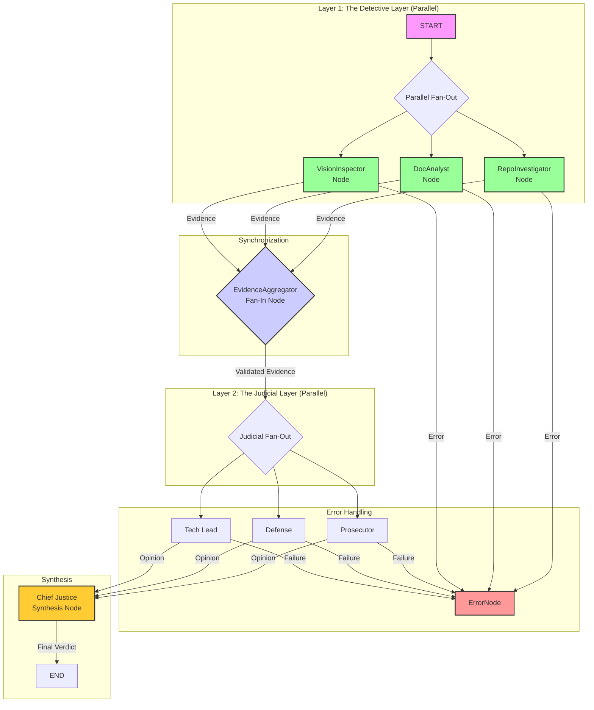

# ⚖️ The Automaton Auditor: Autonomous Governance Swarm

> **Mission Statement**: The Automaton Auditor shifts the paradigm from code generation to code governance, ensuring forensic accuracy, judicial rigor, and autonomous compliance in software workflows.

---

## 🏛️ Architecture: The Digital Courtroom


The Automaton Auditor employs a **Hierarchical State Graph** modeled as a "Digital Courtroom". The orchestration is strictly production-grade, with:

- **Explicit END Layer**: The StateGraph always terminates at an explicit END node, ensuring a clean, deterministic pipeline finish and proper report generation.
- **Parallel-Safe State Updates**: All nodes in parallel fan-in/fan-out (detectives, judges) return only the keys they change (not the full state), preventing merge conflicts and ensuring safe aggregation.
- **Pydantic + Annotated Reducers**: State fields updated in parallel (e.g., evidences, opinions) use Annotated reducers (operator.ior for dicts, operator.add for lists) to guarantee deterministic, parallel-safe state updates.

- **Forensic Layer (Detectives)**: Parallel nodes (`RepoInvestigator`, `DocAnalyst`, `VisionInspector`) gather structured evidence.
- **Judicial Layer (Judges)**: Prosecutor, Defense, and Tech Lead evaluate evidence in parallel with dialectic scoring and persona integrity.
- **Synthesis Layer (Supreme Court)**: Chief Justice node resolves conflicts deterministically, ensuring governance compliance.

---

## 🔄 Orchestration Flow

> **Digital Courtroom Execution**: All layers operate in parallel where possible, with explicit fan-out and fan-in patterns for both detectives and judges. Failure modes are handled at each stage for robust governance.



- **Parallel Fan-Out**: Detectives and Judges operate concurrently for maximum coverage and dialectical rigor.
- **Fan-In Aggregation**: Evidence and opinions are aggregated and synthesized deterministically. Aggregator nodes (like EvidenceAggregator) return an empty dict `{}` to avoid merge conflicts.
- **Explicit END Layer**: The Chief Justice node always routes to an END node, guaranteeing the pipeline terminates and the audit report is written.
- **Failure Modes**: Any node can trigger error handling, ensuring robust and transparent governance.

---

## 🛠️ Core Tech Stack

| Technology   | Purpose                                      |
|--------------|---------------------------------------------|
| **LangGraph**| Orchestrates parallel workflows             |
| **Pydantic** | Enforces state rigor and validation         |
| **AST**      | Enables structural forensic analysis        |

---git 

## ⚙️ Setup & Usage

### Installation

1. Install dependencies:
   ```bash
   make install
   ```

2. (Optional) Create a virtual environment:
   ```bash
   make venv
   ```

3. Set up environment variables:
   ```bash
   cp .env.example .env
   # Fill in REPO_URL and PDF_PATH
   ```

### Running the Audit

1. Run the Digital Courtroom:
   ```bash
   make run
   ```

2. (Optional) Enable observability:
   ```bash
   export LANGCHAIN_TRACING_V2=true
   ```

### Testing & Quality

- Run all tests:
  ```bash
  make test
  ```
- Lint the code:
  ```bash
  make lint
  ```
- Format the code:
  ```bash
  make format
  ```
- Type check:
  ```bash
  make typecheck
  ```

---

## 📜 Project Governance

> **Commit Standards**: This project adheres to [Conventional Commits](https://www.conventionalcommits.org/).

> **Forensic Git History**: Every commit is traceable, ensuring accountability and transparency.

---

## 🐳 Docker & Compose

### Build and Run with Docker

1. Build the image:
   ```bash
   docker build -t automaton-auditor .
   ```
2. Run the container:
   ```bash
   docker run --env REPO_URL=<repo_url> --env PDF_PATH=<pdf_path> automaton-auditor
   ```

### Orchestrate with Docker Compose

1. Set up your .env file with REPO_URL and PDF_PATH.
2. Launch the stack:
   ```bash
   docker-compose up --build
   ```

- **Volumes**: Audit and rubric directories are mounted for persistence and peer review.
- **Environment**: All critical variables are injected for reproducible audits.
- **Restart Policy**: Containers restart unless stopped for reliability.

---


## 🧪 End-to-End Run Example

---

**Note:**
For all audit reports (self, peer, and peer-generated), include the above architectural diagram (Mermaid JS) to clearly communicate the orchestration and error handling structure.

1. **Install dependencies**:
   ```bash
   make install
   ```
2. **Set up environment**:
   ```bash
   cp .env.example .env
   # Fill in REPO_URL and PDF_PATH
   ```
3. **Run the audit**:
   ```bash
   make run
   ```
4. **Review output**:
   - The system will run all detectives and judges in parallel, aggregate evidence, synthesize a final verdict, and write a Markdown audit report to the audit/ directory.
   - All error handling and routing is automatic and explicit per the orchestration graph.