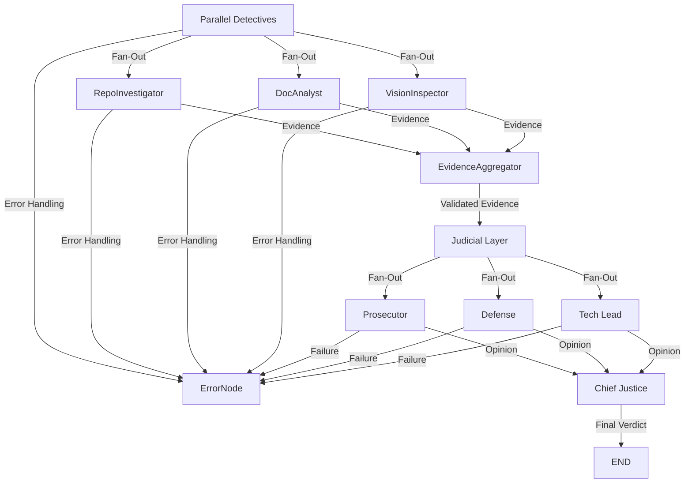

# ⚖️ The Automaton Auditor: Autonomous Governance Swarm

> **Mission Statement**: The Automaton Auditor shifts the paradigm from code generation to code governance, ensuring forensic accuracy, judicial rigor, and autonomous compliance in software workflows.

---

## 🏛️ Architecture: The Digital Courtroom

The Automaton Auditor employs a **Hierarchical State Graph** modeled as a "Digital Courtroom":

- **Forensic Layer (Detectives)**: Parallel nodes (`RepoInvestigator`, `DocAnalyst`, `VisionInspector`) gather structured evidence.
- **Judicial Layer (Judges)**: Prosecutor, Defense, and Tech Lead evaluate evidence in parallel with dialectic scoring and persona integrity.
- **Synthesis Layer (Supreme Court)**: Chief Justice node resolves conflicts deterministically, ensuring governance compliance.

---

## 🔄 Orchestration Flow

> **Digital Courtroom Execution**: All layers operate in parallel where possible, with explicit fan-out and fan-in patterns for both detectives and judges. Failure modes are handled at each stage for robust governance.



- **Parallel Fan-Out**: Detectives and Judges operate concurrently for maximum coverage and dialectical rigor.
- **Fan-In Aggregation**: Evidence and opinions are aggregated and synthesized deterministically.
- **Failure Modes**: Any node can trigger error handling, ensuring robust and transparent governance.

---

## 🛠️ Core Tech Stack

| Technology   | Purpose                                      |
|--------------|---------------------------------------------|
| **LangGraph**| Orchestrates parallel workflows             |
| **Pydantic** | Enforces state rigor and validation         |
| **AST**      | Enables structural forensic analysis        |

---git 

## 🚀 Interim Features

### Parallel Detectives
- **RepoInvestigator**: Analyzes repository structure and git history.
- **DocAnalyst**: Extracts and validates evidence from PDF documents.
- **VisionInspector**: (Planned) Will analyze image-based evidence for completeness.

### Forensic Tools
- **Sandboxed Git Cloning**: Ensures secure repository interactions.
- **AST-Based Graph Verification**: Validates structural integrity of workflows.

---

## ⚙️ Setup & Usage

### Installation

1. Install dependencies:
   ```bash
   uv sync
   ```

2. Set up environment variables:
   ```bash
   cp .env.example .env
   # Fill in REPO_URL and PDF_PATH
   ```

### Running the Audit

1. Execute the audit against a target repository:
   ```bash
   python src/main.py --url <repo_url>
   ```

2. (Optional) Enable observability:
   ```bash
   export LANGCHAIN_TRACING_V2=true
   ```

---

## 📜 Project Governance

> **Commit Standards**: This project adheres to [Conventional Commits](https://www.conventionalcommits.org/).

> **Forensic Git History**: Every commit is traceable, ensuring accountability and transparency.

---

## 🌟 Recent Enhancements

### Enhanced Interim Report
- Added detailed trade-off analyses for architectural decisions.
- Expanded the roadmap with granular implementation details.
- Refined orchestration diagram to show full parallelism and failure modes in both detective and judicial layers.

---

## 🐳 Docker & Compose

### Build and Run with Docker

1. Build the image:
   ```bash
   docker build -t automaton-auditor .
   ```
2. Run the container:
   ```bash
   docker run --env REPO_URL=<repo_url> --env PDF_PATH=<pdf_path> automaton-auditor
   ```

### Orchestrate with Docker Compose

1. Set up your .env file with REPO_URL and PDF_PATH.
2. Launch the stack:
   ```bash
   docker-compose up --build
   ```

- **Volumes**: Audit and rubric directories are mounted for persistence and peer review.
- **Environment**: All critical variables are injected for reproducible audits.
- **Restart Policy**: Containers restart unless stopped for reliability.

---

## 🚦 Production Readiness

- **Pydantic Reducers**: All state transitions use Pydantic models and Annotated reducers (operator.ior for dicts, operator.add for lists) to guarantee deterministic, parallel-safe state updates.
- **AST-Based Verification**: The repo tools provide irrefutable structural evidence by parsing the AST for critical constructs (e.g., BaseModel in src/state.py, StateGraph in src/graph.py), ensuring forensic compliance. Inheritance and function call checks are now explicit and errors are granular.
- **PDF RAG Interface**: PDF evidence is chunked and queryable for RAG-style retrieval, supporting granular document audits.
- **Git Forensics**: Commit history extraction now provides granular error messages for missing repos, permissions, and empty histories.
- **Strict Dependency Locking**: requirements.txt (strictly versioned) and uv are used for deterministic environments. Poetry is not required.
- **CI/CD & Containerization**: Automated CI pipeline, Dockerfile, and Compose orchestration ensure reproducibility and auditability.
- **Parallel Orchestration**: All detective and judicial nodes are executed in parallel, with explicit fan-out/fan-in patterns and robust error handling. Conditional error routing is implemented for detector-specific failures and aggregation errors.

---

## 🧪 End-to-End Run Example

1. **Install dependencies**: `uv sync`
2. **Set up environment**: `cp .env.example .env` and fill in required variables.
3. **Run the audit**: `python src/main.py --url <repo_url>`
4. **Observe output**: The system will:
   - Run all detectives in parallel (repo, PDF, vision)
   - Aggregate evidence, route errors if any detective fails
   - Fan-out to all judges in parallel
   - Synthesize a final verdict via the Chief Justice
   - Route any aggregation or judge failure to the error node
5. **Review logs and reports**: All evidence, errors, and verdicts are logged for peer review.

**Failure Handling:**
- If any detective fails (e.g., missing repo, PDF, or image), error routing is triggered and the error node is activated.
- If aggregation detects missing or invalid evidence, the error node is triggered before judicial review.
- All error paths are explicit and testable, ensuring robust governance.