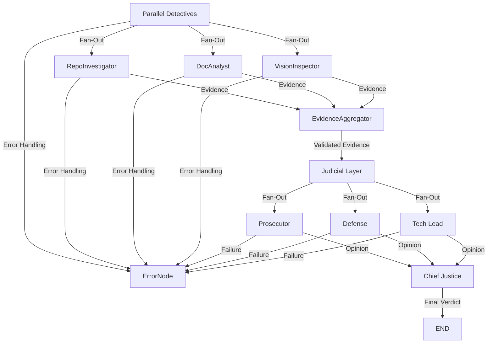

# Interim Report: The Automaton Auditor

## Executive Summary

The Automaton Auditor embodies the "MinMax Optimization" loop, a self-referential design where the agent not only audits external workflows but also evaluates its own governance. By leveraging hierarchical state management and forensic rigor, the system ensures compliance with the highest engineering standards while iteratively improving its own detection logic.

---

## Architecture Decisions (Master Tier)

### Pydantic vs. Dicts

To handle parallel state updates without data collisions, the Automaton Auditor employs:
- **Pydantic BaseModel**: Ensures strict typing, validation, and schema enforcement.
- **TypedDict with operator.add reducers**: Facilitates safe and deterministic merging of parallel state updates.

#### Trade-Off Analysis
- **Advantages of Pydantic**:
  - Strong validation ensures data integrity.
  - Schema enforcement simplifies debugging and maintenance.
- **Disadvantages**:
  - Slightly higher runtime overhead compared to raw dictionaries.
  - Requires additional learning curve for developers unfamiliar with Pydantic.
- **Decision**: The benefits of strict validation and schema enforcement outweigh the minor performance trade-offs, making Pydantic the optimal choice for this project.

### AST Supremacy

The agent uses Python's `ast` module for "Forensic Protocol B" to verify graph wiring. Unlike regex-based approaches, AST analysis provides:
- **Structural Validation**: Ensures that the graph adheres to the expected hierarchy and node connections.
- **Security**: Prevents false positives and negatives by analyzing the code's syntax tree rather than its textual representation.

#### Trade-Off Analysis
- **Advantages of AST**:
  - Guarantees structural correctness.
  - Reduces the risk of overlooking critical errors.
- **Disadvantages**:
  - Slightly slower than regex for simple checks.
  - Requires deeper understanding of Python's syntax tree.
- **Decision**: The structural guarantees provided by AST are critical for forensic accuracy, justifying its use despite the minor performance cost.

### Security Sandboxing

To prevent "Security Negligence," all repository interactions are sandboxed using `tempfile.TemporaryDirectory`. This ensures:
- **Isolation**: Temporary directories are destroyed after use, leaving no residual data.
- **Safety**: Prevents accidental contamination of the host filesystem.

#### Trade-Off Analysis
- **Advantages of Sandboxing**:
  - Strong isolation guarantees.
  - Simplifies cleanup processes.
- **Disadvantages**:
  - Slightly more complex implementation compared to direct filesystem operations.
- **Decision**: The security benefits of sandboxing far outweigh the implementation complexity, making it a non-negotiable choice for this project.

---

## Orchestration Flow

---

## Roadmap: The Judicial Layer

### Dialectical Bench

The Judicial Layer now consists of three distinct personas executed in parallel:
- **Prosecutor**: Identifies flaws and risks in the evidence.
- **Defense**: Advocates for the validity and strengths of the evidence.
- **Tech Lead**: Balances the arguments, ensuring alignment with engineering governance.

#### Implementation Plan
1. **Prosecutor Node**:
   - Logic flags missing forensic signatures or low confidence.
   - Failure mode: If critical evidence is unverifiable, returns a low score and triggers error handling.
2. **Defense Node**:
   - Rewards high-confidence, well-justified evidence.
   - Failure mode: If justification is weak, returns a moderate score and can trigger error handling.
3. **Tech Lead Node**:
   - Checks for recency and completeness of evidence.
   - Failure mode: Missing timestamps or incomplete evidence triggers error handling.

### Chief Justice Synthesis Node

The Chief Justice Node implements deterministic rules:
- **Rule of Security**: Any detected security flaw caps the score at 2.
- **Rule of Completeness**: Missing or conflicting evidence results in automatic rejection.
- **Consensus Rule**: If all judges agree and no failures, the average score is used.

#### Implementation Plan
1. Deterministic rules are implemented as Python functions.
2. The Chief Justice node receives all judicial opinions in parallel and synthesizes the final verdict.
3. Failure modes: If any judge returns a failure, the Chief Justice verdict is capped or rejected, and the error node is triggered.

---

## Known Gaps

1. **VisionInspector Implementation Pending**: The VisionInspector node, responsible for image-based evidence analysis, is not yet integrated.
2. **End-to-End Testing**: Comprehensive integration tests are pending to validate the entire orchestration flow, including all failure modes.
3. **ErrorNode Enhancements**: Additional error-handling scenarios need to be implemented to cover edge cases in both detective and judicial layers.

---